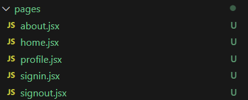

# MERN Stack Project: Build a Modern Real Estate Marketplace with react MERN (jwt, redux toolkit)

This template provides a minimal setup to get React working in Vite with HMR and some ESLint rules. Using Express.js, Node.js, Tailwind CSS, MongoDB

So Follow This docmentation step by step so that you can esaily get to the end of the project.

#### STEP 1:

#### Creating Pages and Routes:

- create a folder (Pages in /src/pages)
- create files in pages folder Home, About, Profile, signout, signin and other as per your use
  

---

Currently, two official plugins are available:

- [@vitejs/plugin-react](https://github.com/vitejs/vite-plugin-react/blob/main/packages/plugin-react/README.md) uses [Babel](https://babeljs.io/) for Fast Refresh
- [@vitejs/plugin-react-swc](https://github.com/vitejs/vite-plugin-react-swc) uses [SWC](https://swc.rs/) for Fast Refresh
