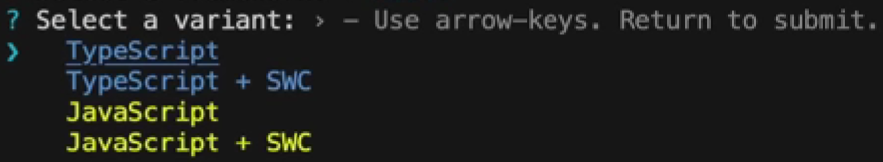
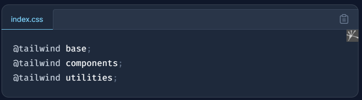

# **Developing a Modern E-commerce Platform with MERN Stack**

**Welcome to this comprehensive guide for creating an advanced e-commerce application using the MERN stack (MongoDB, Express.js, React, and Node.js). This template streamlines the setup process, integrating JWT for authentication, Redux Toolkit for state management, Vite for rapid development, and Tailwind CSS for styling.**

**Follow these steps for a smooth project journey:**

1. **Prerequisites :**

   - Make sure Node.js (version 14 or above) and MongoDB are installed on your system.
     Click Here - [Node.js](https://nodejs.org/en/download)
     Click Here - [MongoDB](https://www.mongodb.com/try/download/community)
   - Basic knowledge of React, Node.js, and MongoDB is recommended.
2. **Setting Up the Project :**

   - Create a folder name as client in your **[ Parent Folder ]**
   - Type this command in the terminal
     ``npm create vite@latest [folder name]``

     
   - Select a variant `Javascript + SWC`

     
   - Go inside the client folder `cd client`
   - Type this command in the terminal ``npm i``
   - Install Tailwind CSS with Vite [CLICK HERE](https://tailwindcss.com/docs/guides/vite) then follow the process till 5th Step.
   - In the 4th step just remove all the CSS and paste the below code.
     
   - Delete the SVG files from public and assets folder
   - and now work in app.jsx

### Creating Pages and Routes:

- create a folder (Pages in /src/pages)
- create files in pages folder Home, About, Profile, signout, signin and other as per your use

  File Structure

---

Currently, two official plugins are available:

- [@vitejs/plugin-react](https://github.com/vitejs/vite-plugin-react/blob/main/packages/plugin-react/README.md) uses [Babel](https://babeljs.io/) for Fast Refresh
- [@vitejs/plugin-react-swc](https://github.com/vitejs/vite-plugin-react-swc) uses [SWC](https://swc.rs/) for Fast Refresh

[def]: image/README/1704195185314.mp4
